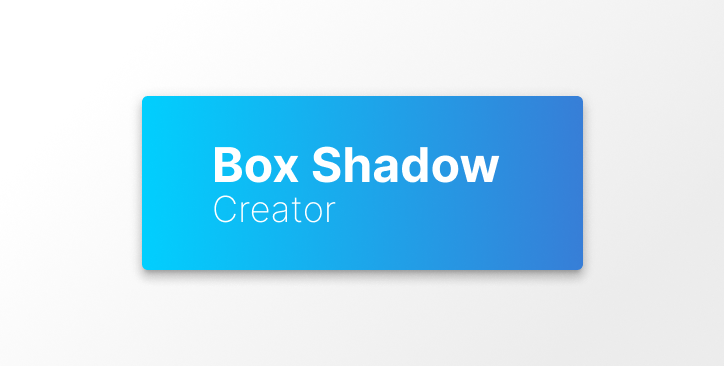

# Box Shadow Creator

> Web application to create box shadows

 

## Frameworks utilisés

- [Vue](https://v3.vuejs.org/)

## Librairies utilisées

- [Vite](https://vitejs.dev/)

## Meta

Damien Heulin – [Linkedin](https://www.linkedin.com/in/damien-heulin/) – [Mail](mailto:damienheulin87@gmail.com) – [Github](https://github.com/damien-hl)
